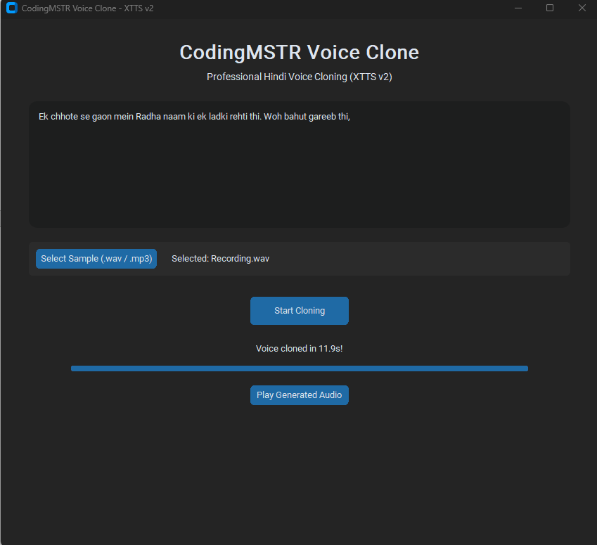

# 🎙️ CodingMSTR Hindi Voice Clone: The Ultimate Eleven Labs Free Alternative

[](https://github.com/ipraveenkmr/Hindi-Voice-Cloning)
[](https://github.com/ipraveenkmr/Hindi-Voice-Cloning)
[](LICENSE)

Experience professional-grade **Open Source AI Hindi Voice Cloning** right on your local machine. This project provides a powerful, private, and unlimited solution to **Clone Any Voice in Hindi** using the state-of-the-art **XTTS v2** model.

## ✨ Why CodingMSTR Voice Clone?

If you are looking for an **Eleven Labs Free Alternative**, this is it. No character limits, no monthly subscriptions, and 100% data privacy.

*   **Zero-Shot Cloning**: Replicate any voice with just a 10-30 second audio sample.
*   **Hindi Optimization**: Specifically tuned for Devanagari script, emotional nuances, and regional Hindi accents.
*   **Modern Desktop Hub**: A sleek, glassmorphic GUI built for performance and ease of use.
*   **Privacy First**: Entirely local execution. Your voice data never hits the cloud.

---

## 📸 Screenshots


*Modern Glassmorphic UI for seamless interaction*

---

## 🚀 Getting Started (Free Download)

Follow these steps to set up your local voice cloning studio.

### 1. Prerequisites
- **Python 3.10**: Strictly recommended for compatibility with TTS libraries.
- **Microsoft C++ Build Tools**: Required for compiling C++ extensions.
  - **IMPORTANT**: During installation, check "Desktop development with C++", "MSVC v143", and "Windows 10/11 SDK".

### 2. Installation
```powershell
# Clone the repository
git clone https://github.com/ipraveenkmr/Hindi-Voice-Cloning.git
cd Hindi-Voice-Cloning

# Create and activate virtual environment
py -3.10 -m venv env
.\env\Scripts\activate

# Install high-performance dependencies
pip install -r requirements.txt
```

### 3. Running the App
Launch the desktop application:
```powershell
python app.py
```

---

## 🛠️ Technical Deep Dive

- **Engine**: Coqui TTS with XTTS v2 bridge.
- **Support**: Multilingual (Native Hindi support).
- **Inference**: Optimized for both NVIDIA GPU (CUDA) and CPU.
- **Output**: 24kHz Studio-quality WAV files.

## 📂 Project Structure
- `app.py`: The main GUI application (CustomTkinter).
- `main.py`: Command-line script for batch processing.
- `details.txt`: Comprehensive troubleshooting and setup logs.
- `landing.html`: Professional landing page for web deployment.

## ⚖️ Ethical Use & License
This project is for educational and research purposes. Please ensure you have the explicit permission of the individual whose voice you are cloning. 

---

**CodingMSTR Voice Clone** — Empowering creators with Open Source AI.
